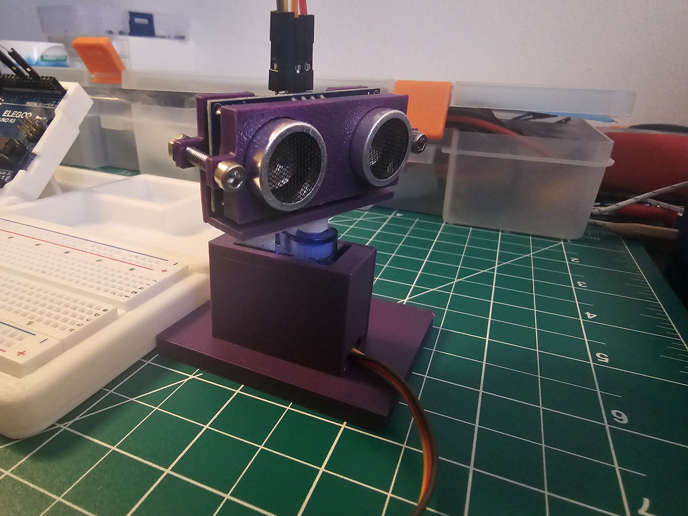
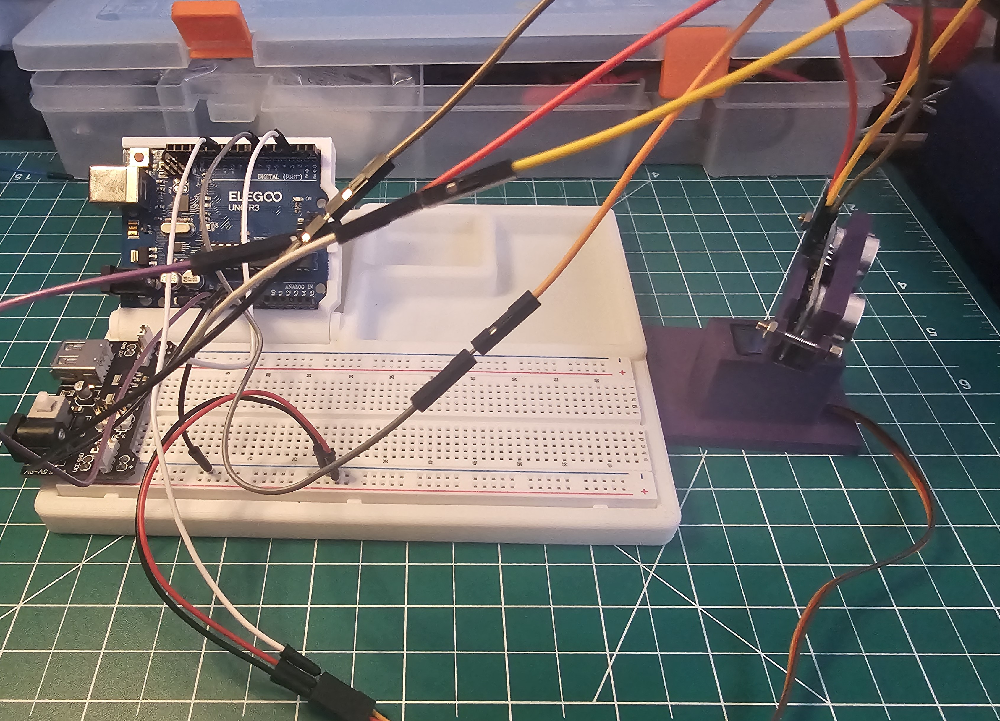
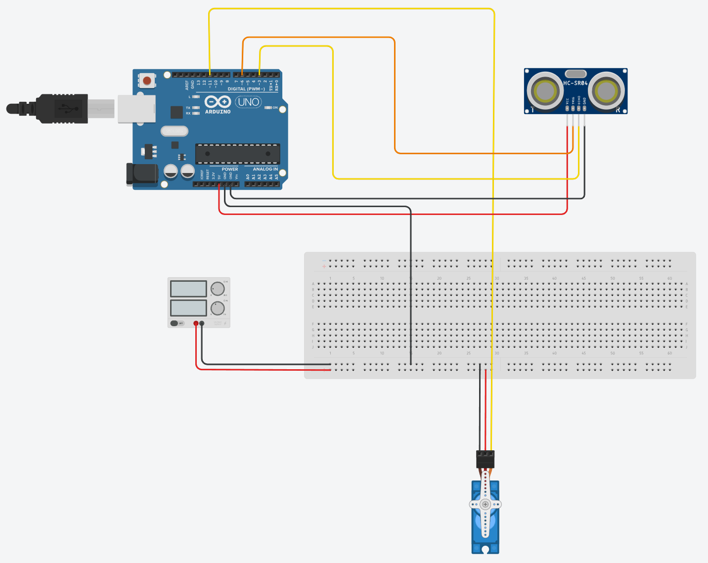
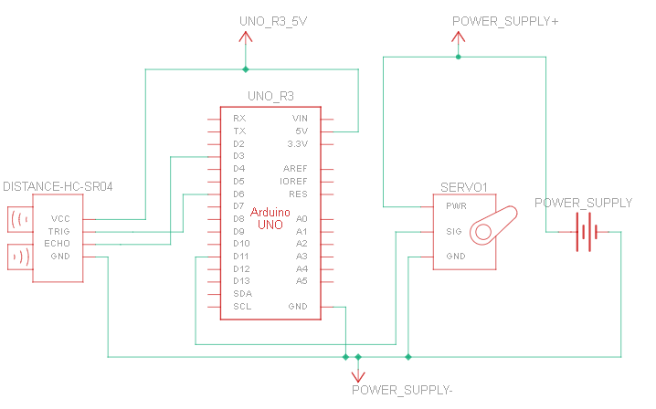
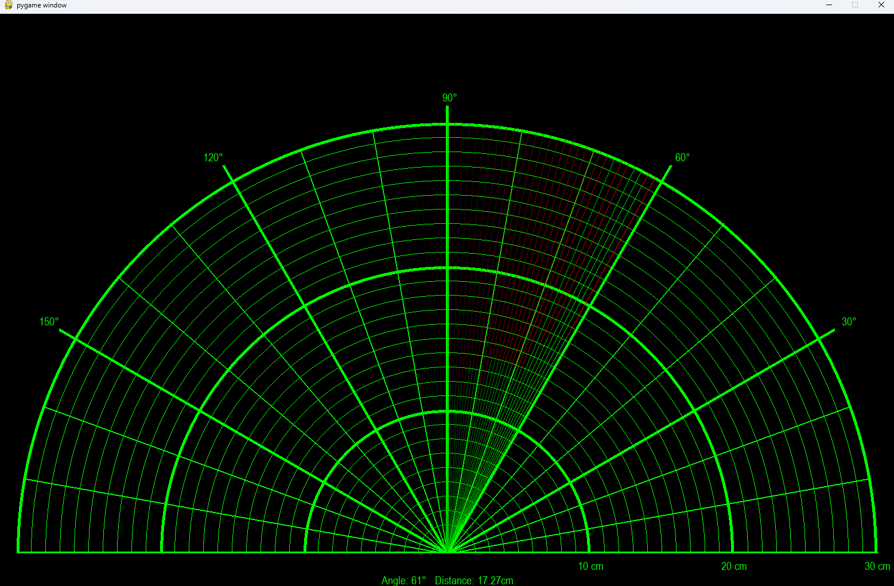

# Ultrasonic Radar

A real-time ultrasonic radar built with an Arduino Uno, HC-SR04 sensor, and SG90 servo motor. The servo sweeps the sensor across a 150° arc while the Arduino measures distances via time-of-flight. Readings are streamed over serial to a Python/PyGame visualization displaying a live polar radar sweep.



---

## How It Works

The SG90 servo rotates the HC-SR04 sensor from 15° to 165° in 1° steps with a 30ms delay per step. At each angle, the sensor emits a 40kHz ultrasonic pulse and measures the time for the echo to return. The Arduino converts this to distance using the speed of sound at 15 degrees Celsius and sends `angle,distance` pairs over serial at 9600 baud.

The Python script reads this serial stream in real time and renders a polar grid in PyGame. The sweep line is green up to the detected object and red beyond it, with a fading trail showing recent sweep history.

---

## Hardware

| Component | Quantity |
|---|---|
| Arduino Uno R3 | 1 |
| HC-SR04 Ultrasonic Sensor | 1 |
| SG90 Micro Servo | 1 |
| Breadboard Power Module (USB) | 1 |
| Breadboard | 1 |
| Jumper Wires | Several |

All mechanical mounts were custom designed in Autodesk Inventor and 3D printed on a Bambu Lab A1 Mini.



---

## Wiring





| HC-SR04 Pin | Arduino Pin |
|---|---|
| VCC | 5V |
| TRIG | D8 |
| ECHO | D9 |
| GND | GND |

| SG90 Pin | Connection |
|---|---|
| VCC (Red) | Breadboard Power Module 5V |
| GND (Brown) | Common GND |
| Signal (Orange) | Arduino D10 |

> **Note:** The servo must be powered from the breadboard power module, not directly from the Arduino 5V pin. The Arduino cannot supply enough current for the servo under load.

---

## Demo



---

## Software Dependencies

**Firmware**
- Arduino IDE 2.x

**Visualization**
- Python 3.x
- PyGame
- PySerial

Install Python dependencies:
```
pip install pygame pyserial
```

---

## Setup & Usage

**1. Flash the firmware**

Open `firmware/radar.ino` in Arduino IDE. All three `.ino` files (`radar.ino`, `sensor.ino`, `servo.ino`) must be in the same folder — Arduino IDE will compile them together automatically. Upload to the Arduino Uno.

**2. Configure the serial port**

Open `visualization/radar.py` and update line 3 to match your Arduino's COM port:
```python
com = 'COM4'  # Change this to your port (e.g. COM3, /dev/ttyUSB0 on Linux)
```

**3. Run the visualization**

With the Arduino connected and powered:
```
python radar.py
```

---

## Known Limitations

- Maximum detection range is 30cm. The HC-SR04 supports up to 400cm, but the sweep speed and serial throughput were tuned for short range.
- The COM port is hardcoded in `radar.py` and must be manually changed per machine.
- If no serial data is received, the visualization freezes — there is no timeout or reconnection logic.
- Measurement accuracy is approximately ±0.2cm at 30cm distance.

---

## Future Improvements

- Configurable COM port and baud rate via command line arguments instead of hardcoded values
- Serial timeout and reconnection logic to prevent visualization freezing on data loss
- Increase detection range beyond 30cm by tuning sweep speed and serial throughput
- Export scan data to CSV for offline analysis
- 3D printed enclosure to house the Arduino and breadboard as a single unit

---

## License

MIT License — see [LICENSE](LICENSE) for details.
